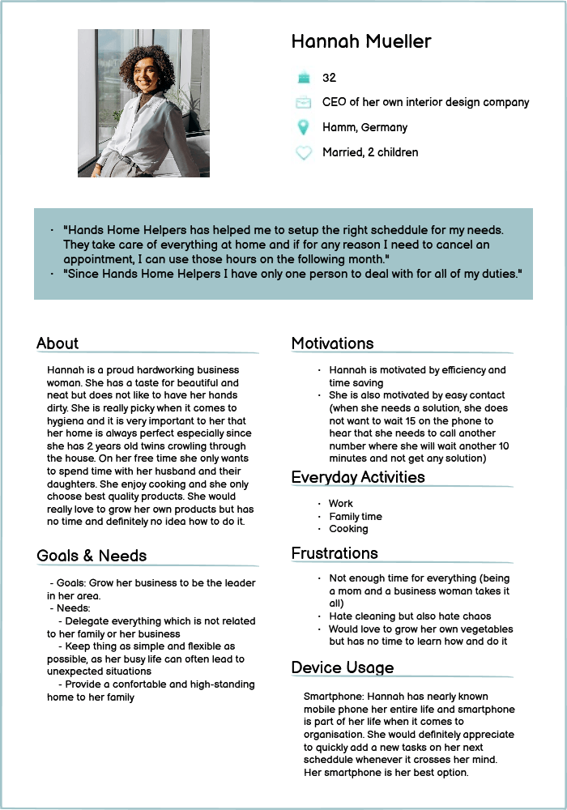

# Hands Home Helpers

This project aims to create a website for the Hands Home Helpers company, based in NRW, GERMANY, so they can have an online presence to promote their activity and reach new customers. The website also aims to provide a user-friendly interface to make contacts between the company and its customers easier.

Hands Home Helpers is a premium housekeeping company with a wide range of services. They offer to take care of your house and garden duties as well as maintening your swimming pool and fixing small issues or doing small renovation. Finally, they also provide a home care service to assist you in your everyday life.

**- by Yannick Ferenczi -**

**[Live site](https://hands-home-helpers-website-a2058240b625.herokuapp.com/) | [Repository](https://github.com/yannickferenczi/hands-home-helpers-website)**

-- built with --

---

## UX Design

### 1.2.1. Strategy Plane

#### 1.2.1.1. Business Plan

What problem will the business solve?

> Todos at home take a huge amount of time lessing less time for people to enjoy their hobby/family

What will the business provide to solve that problem?

> Provide a team of qualified workers to take care of their most complicated or annoying tasks and to provide assistance.

How will the business make money?

> The business makes money by providing really high-quality work and 'all-in-one' solution to the housekeeping matter.

Who will purchase our products or services?

> The potential customers of the business can be:
> - retired people in need of assistance for some particular tasks (they have time to take care of most of their duties but need help for the heavy ones)
> - High-standing people with big properties, including facilities such as a swimming pool for instance, which are nice to have when well maintained but mean too much care.

How will our target customers learn about our business?

> Promotion on social media, in Gardening shops and with an online presence.

What will the business do better than the competitors?

> The business will bring efficiency (with the all-in-one concept), high-quality results and flexibility.

How much money do you

- need to start?
- spend every month?
- earn every month?

  > To be able to run fully featured, the business needs two employees (one competent within gardening, swimming pool caring and doing small repairs/installation and one competent within cleaning)
  > To start: 7 000 € | every month: + 8 712 € / - 5 200 €
  > This brings a 40% margin to the business which should be spread like below:
  > - 10% employee training
  > - 10% company equipment
  > - 10% marketing
  > - 10% profit

How much money do you need to start and operate the business?

> 0, the business owner will start with their own fonds.

#### 1.2.1.2. Goals and objectives

Objectives for the website are:

- An easy to navigate website with clear purpose
- Allow users to create a personal account
- To provide users with insights or tips on how to take good care of their home and garden.

Goals for the site owner are:

- have an online presence
- promote their business
- reduce customer solicitations by providing them an online booking system and a FAQs page

Goals for the site user are:

- discover the purpose of the business
- discover the offers of the business
- get insights and tips on how they could improve the quality of their housekeeping
- list their home tasks

#### 1.2.1.3. Target Audience

Hands Home Helpers is a B2C company.

##### 1.2.1.3.1. User Research

A user reseach has been ran on 85 persons.

Important information out of it are as below:

- nearly 100% of household with an income higher than 7 000 € per month use housekeeping services

- what they value most is personal growth, time with their friends and family, health and wellness

- the household average constitution for people using housekeeping services is as below:

  - 5 persons
  - 5 bedrooms
  - 3 bathrooms

- important for them when choosing a vendor:

  1. good customer review average
  2. physical presence nearby
  3. easy-to-use services

- important when choosing housekeeping provider:

  1. trustworthy (qualified workers and clear insurance policy)
  2. reliability
  3. flexibility

- average frequency is once or twice per week

- most common required services are

  1. house cleaning
  2. gardening
  3. swimming pool caring
  4. fixing or installing things at home
  5. garden patch caring (70% would appreciate to have their own vegetables but do not have time to take care of their garden patch)

- specific areas with special attention:

  1. high-standing kitchen
  2. bathroom with marble

- three budget classes could be identified:

  1. full help required => 21 hours per week (3 days x 7 hours) => 2 745 € per month (30 € per hour)
  2. smaller full help required => 12 hours per week (2 days x 6 hours) => 1 673 € per month (32 € per hour)
  3. minimum help required => 5 hours per week (on 1 day) => 762.5 € per month (35 € per hour)

- the preferred payment method for housekeeping services is the subscription for 85% of those service users. They would also mostly appreciate to keep the benefit of unused hours for the following month.

- the preferred booking method is online booking with 68% and then calling with 25%

- the preferred communication method are online chat and calling with 40% for both

- most reasons they would change their housekeeping services are:
  1. the price
  2. all in one (they could replace their different providers for house cleaning, gardening and repairs with one single provider)

##### 1.2.1.3.2. Buyer Personas

Out of the user research, two personas have been created to understand and illustrate in a more concrete representation the ideal customer of Hands Home Helpers.

Persona 1:

Persona 2:

### 1.2.2. Scope Plane

In this particular project, there is two kind of minimum viable product (MVP).

1. The first one, which is educational oriented, is to provide everything expected for the assessment criteria to pass. So everything will at first be developed regarding this scope.
2. Nevertheless, with the first mvp, the business would not be competitive. So the second mvp, which is more business oriented, is to provide the website with a real value that could give the business an edge over its competitors. This must be developed too.

#### 1.2.2.1. Define Must-Have Features

EVERY WEB PROJECT MUST-HAVE FEATURES:

- responsive navigation menu
- logo
- social media links
- error 404 page
- error 500 page
- favicon

NOTIFICATIONS:

To create a positive user experience, notifications will be provided when users are taking actions such as:

- confirmation on registration
- confirmation on login
- confirmation on item created
- confirmation on item successfully edited
- confirmation request when user wants to delete item
- confirmation item successfully deleted

AUTHENTICATION SYSTEM:

An authentication system is mandatory and should allow users to

- register
- login
- logout
- have access to restricted features

TASK MANAGEMENT SYSTEM:

A task management system will help users to communicate with the company on their task in an easy way. This system should allow users to

- create new tasks (C)
- list their tasks (R)
- modify their tasks (U)
- delete their tasks (D)

CONTACT FORM

A contact form should be available for users to contact the company in a most convenient way.

#### 1.2.2.2. Define Information to provide (content requirements)

In the first mvp scope, the needed information are:

- explain the purpose of the website
- indicate users how to use the website by naming links and features with intuitive words

### 1.2.3. Structure Plane

#### 1.2.3.1. Interaction Design (IXD)

##### 1.2.3.1.1. Define Pages

- landing page
- registration page
- login page
- logout page
- tasks list page
- add task page
- task detail page
- edit task page
- about page (including meet the team section, FAQ section, review section)

##### 1.2.3.1.2. Handle errors

Error 404 and error 500 pages are also to be implemented within the mvp scope.

##### 1.2.3.1.3. Flow Chart

A flowchart has been design to help stakeholders with the development of the website:

#### 1.2.3.2. Information Architecture (IA)

information is organized with some known patterns so that users easily find what they are looking for such as:

- navigation menu on the top right
- name and logo on the top left
- social media links in the footer
- company address and contact in the footer

### 1.2.4. Skeleton Plane

#### 1.2.4.1. Wireframes

Landing page:

Registration page:

Login page:

List of tasks page:

Task detail page:

Edit task page:

Error 404 page:

Error 500 page:

### 1.2.5. Surface Plane

#### Color Palette

Three colors have been chosen on top of black and white.
The first color (#9d3f3f) is the color of the logo: The ant. This logo has been pick to communicate how brave and hardworking are the employees and how efficient will be the working hours. The other colors have been selected using a color calculator to be the best fit to this very first color.

#### Font Choices

Two fonts have been used within the whole website. They both are sans-serif. Andika has been picked for the titles to give users a feeling of sober and neat. And Merriweather Sans has been picked for the standard text has it is a good match to Andika.

### 1.2.6. Database Schema

At minimum viable product:

---

## Features

---

## Technology Used

---

## Testing

---

## Deployment

---

## Credits

---

## Acknowledgements

