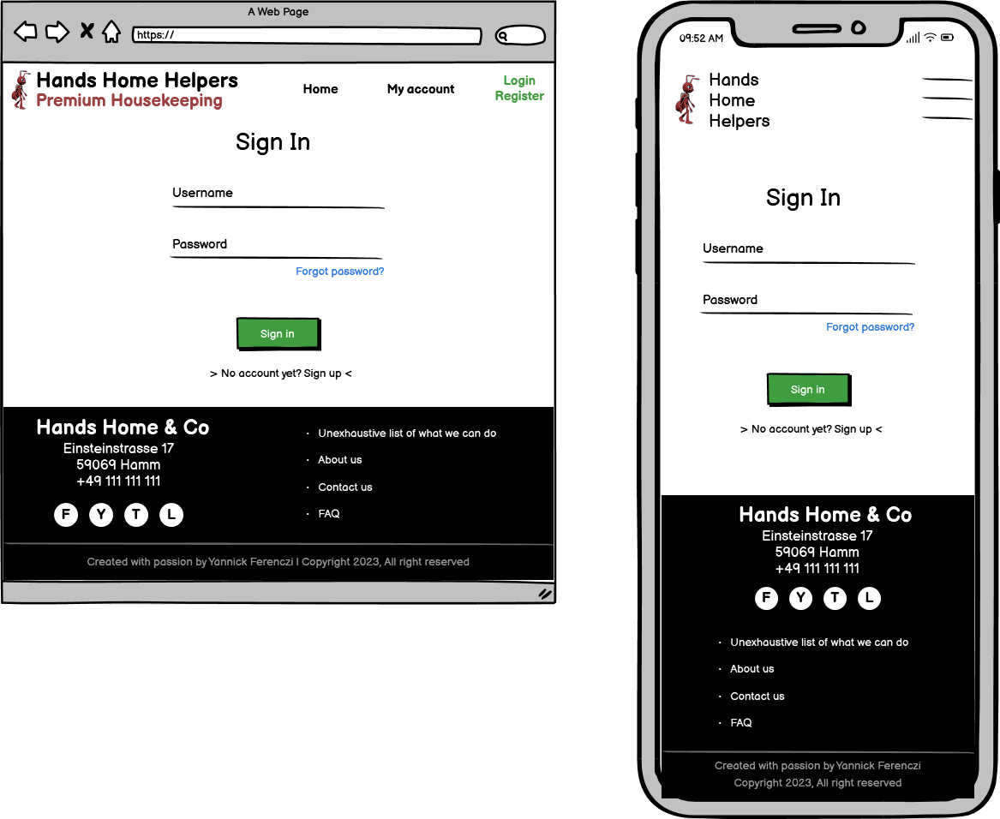
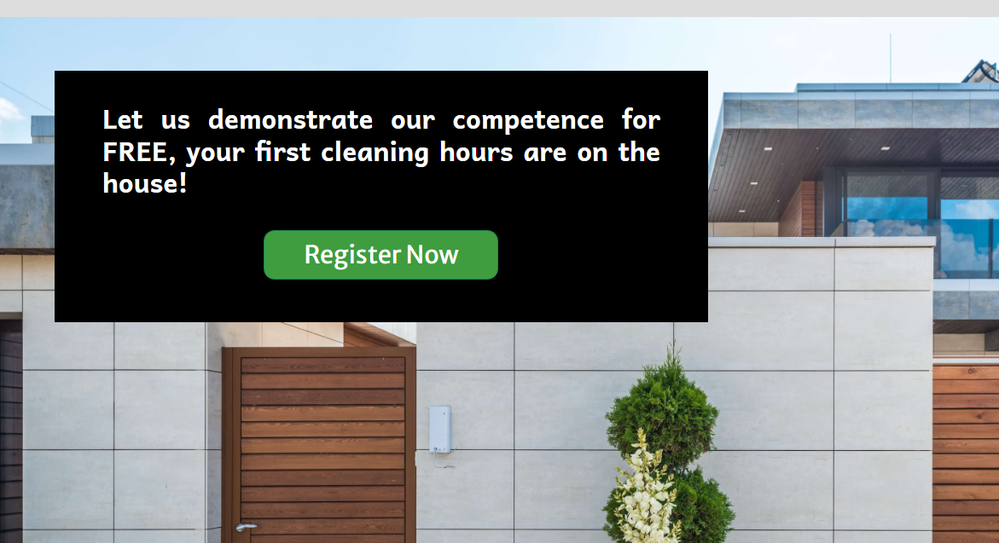

<div align=center>

# Hands Home Helpers


This project aims to create a website for the Hands Home Helpers company, based in NRW, GERMANY, so they can have an online presence to promote their activity and reach new customers. The website also aims to provide a user-friendly interface to make contacts between the company and its customers easier.

Hands Home Helpers is a premium housekeeping company with a wide range of services. They offer to take care of your house and garden duties as well as maintain your swimming pool and fix small issues or do small renovations. Finally, they also provide a home care service to assist you in your everyday life.


**- by Yannick Ferenczi -**

**[Live site](https://hands-home-helpers-website-a2058240b625.herokuapp.com/) | [Repository](https://github.com/yannickferenczi/hands-home-helpers-website)**

-- built with --
<p style="background-color: white; padding: 5px; display: inline-block; margin: 0 auto;">


</p>

</div>

---

<div align="center">

## UX Design

</div>

### 1.2.1. Strategy Plane

#### 1.2.1.1. Business Plan

What problem will the business solve?

> Todos at home take a huge amount of time lessing less time for people to enjoy their hobby/family

What will the business provide to solve that problem?

> Provide a team of qualified workers to take care of their most complicated or annoying tasks and to provide assistance.

How will the business make money?

> The business makes money by providing really high-quality work and 'all-in-one' solution to the housekeeping matter.

Who will purchase our products or services?

> The potential customers of the business can be:
> - retired people in need of assistance for some particular tasks (they have time to take care of most of their duties but need help for the heavy ones)
> - High-standing people with big properties, including facilities such as a swimming pool for instance, which are nice to have when well maintained but mean too much care.

How will our target customers learn about our business?

> Promotion on social media, in Gardening shops and with an online presence.

What will the business do better than the competitors?

> The business will bring efficiency (with the all-in-one concept), high-quality results and flexibility.

How much money do you

- need to start?
- spend every month?
- earn every month?

  > To be able to run fully featured, the business needs two employees (one competent within gardening, swimming pool caring and doing small repairs/installation and one competent within cleaning)
  > To start: 7 000 € | every month: + 8 712 € / - 5 200 €
  > This brings a 40% margin to the business which should be spread like below:
  > - 10% employee training
  > - 10% company equipment
  > - 10% marketing
  > - 10% profit

How much money do you need to start and operate the business?

> 0, the business owner will start with their own fonds.

#### 1.2.1.2. Goals and objectives

Objectives for the website are:

- An easy to navigate website with clear purpose
- Allow users to create a personal account
- To provide users with insights or tips on how to take good care of their home and garden.

Goals for the site owner are:

- have an online presence
- promote their business
- reduce customer solicitations by providing them an online booking system and a FAQs page

Goals for the site user are:

- discover the purpose of the business
- discover the offers of the business
- get insights and tips on how they could improve the quality of their housekeeping
- list their home tasks

#### 1.2.1.3. Target Audience

Hands Home Helpers is a B2C company.

##### 1.2.1.3.1. User Research

A user reseach has been ran on 85 persons.

Important information out of it are as below:

- nearly 100% of household with an income higher than 7 000 € per month use housekeeping services

- what they value most is personal growth, time with their friends and family, health and wellness

- the household average constitution for people using housekeeping services is as below:

  - 5 persons
  - 5 bedrooms
  - 3 bathrooms

- important for them when choosing a vendor:

  1. good customer review average
  2. physical presence nearby
  3. easy-to-use services

- important when choosing housekeeping provider:

  1. trustworthy (qualified workers and clear insurance policy)
  2. reliability
  3. flexibility

- average frequency is once or twice per week

- most common required services are

  1. house cleaning
  2. gardening
  3. swimming pool caring
  4. fixing or installing things at home
  5. garden patch caring (70% would appreciate to have their own vegetables but do not have time to take care of their garden patch)

- specific areas with special attention:

  1. high-standing kitchen
  2. bathroom with marble

- three budget classes could be identified:

  1. full help required => 21 hours per week (3 days x 7 hours) => 2 745 € per month (30 € per hour)
  2. smaller full help required => 12 hours per week (2 days x 6 hours) => 1 673 € per month (32 € per hour)
  3. minimum help required => 5 hours per week (on 1 day) => 762.5 € per month (35 € per hour)

- the preferred payment method for housekeeping services is the subscription for 85% of those service users. They would also mostly appreciate to keep the benefit of unused hours for the following month.

- the preferred booking method is online booking with 68% and then calling with 25%

- the preferred communication method are online chat and calling with 40% for both

- most reasons they would change their housekeeping services are:
  1. the price
  2. all in one (they could replace their different providers for house cleaning, gardening and repairs with one single provider)

##### 1.2.1.3.2. Buyer Personas

Out of the user research, two personas have been created to understand and illustrate in a more concrete representation the ideal customer of Hands Home Helpers.

Persona 1:


Persona 2:


### 1.2.2. Scope Plane

In this particular project, there is two kind of minimum viable product (MVP).

1. The first one, which is educational oriented, is to provide everything expected for the assessment criteria to pass. So everything will at first be developed regarding this scope.
2. Nevertheless, with the first mvp, the business would not be competitive. So the second mvp, which is more business oriented, is to provide the website with a real value that could give the business an edge over its competitors. This must be developed too.

#### 1.2.2.1. Define Must-Have Features

EVERY WEB PROJECT MUST-HAVE FEATURES:

- responsive navigation menu
- logo
- social media links
- error 404 page
- error 500 page
- favicon

NOTIFICATIONS:

To create a positive user experience, notifications will be provided when users are taking actions such as:

- confirmation on registration
- confirmation on login
- confirmation on item created
- confirmation on item successfully edited
- confirmation request when user wants to delete item
- confirmation item successfully deleted

AUTHENTICATION SYSTEM:

An authentication system is mandatory and should allow users to

- register
- login
- logout
- have access to restricted features

TASK MANAGEMENT SYSTEM:

A task management system will help users to communicate with the company on their task in an easy way. This system should allow users to

- create new tasks (C)
- list their tasks (R)
- modify their tasks (U)
- delete their tasks (D)

CONTACT FORM

A contact form should be available for users to contact the company in a most convenient way.

#### 1.2.2.2. Define Information to provide (content requirements)

In the first mvp scope, the needed information are:

- explain the purpose of the website
- indicate users how to use the website by naming links and features with intuitive words

### 1.2.3. Structure Plane

#### 1.2.3.1. Interaction Design (IXD)

##### 1.2.3.1.1. Define Pages

- landing page
- registration page
- login page
- logout page
- tasks list page
- add task page
- task detail page
- edit task page
- about page (including meet the team section, FAQ section, review section)

##### 1.2.3.1.2. Handle errors

Error 404 and error 500 pages are also to be implemented within the mvp scope.

##### 1.2.3.1.3. Flow Chart

A flowchart has been design to help stakeholders with the development of the website:


#### 1.2.3.2. Information Architecture (IA)

information is organized with some known patterns so that users easily find what they are looking for such as:

- navigation menu on the top right
- name and logo on the top left
- social media links in the footer
- company address and contact in the footer

### 1.2.4. Skeleton Plane

#### 1.2.4.1. Wireframes

Landing page:


Registration page:


Login page:


List of tasks page:


Task detail page:


Edit task page:


Error 404 page:


Error 500 page:


### 1.2.5. Surface Plane

#### Color Palette

Three colors have been chosen on top of black and white.
The first color (#9d3f3f) is the color of the logo: The ant. This logo has been pick to communicate how brave and hardworking are the employees and how efficient will be the working hours. The other colors have been selected using a color calculator to be the best fit to this very first color.


#### Font Choices

Two fonts have been used within the whole website. They both are sans-serif. Andika has been picked for the titles to give users a feeling of sober and neat. And Merriweather Sans has been picked for the standard text has it is a good match to Andika.

### 1.2.6. Database Schema

For the minimum viable product:


First extension of the erd:


---

<div align="center">

## Agile Development

</div>

The project development has been managed with an agile project manager on GitHub. It is public [here](https://github.com/users/yannickferenczi/projects/15/views/1).

### The workflow

The workflow of the project has been broken down into small organized pieces to help realise the amount of work and help spread it over the given period. It organize a hierarchy as below:


<details>
    <summary>the full project (represented by the project manager)</summary>
    <p>The project manager has been a roadbook, leading the developmet of this project to its success, handling quite well the stress of such a challenge.</p>
</details>


<details>
    <summary>Milestones</summary>
    <p>4 Milestones were developped for this project, leading the web application to a more and more powerful tool.
    <ul>
    <li>The first Milestone was a guideline toward the minimum viable product. When that was achieved, the project could already be submitted.</li>
    <li>The second and the third Milestones were there to bring more features to the project and implement some automated testing to develop a more robust project.</li>
    <li>Finally, the fourth Milestone is there to help submit a project where attention has been given to details.</li>
    </ul>
    </p>
</details>

<details>
    <summary>EPICS</summary>
    <p>Milestones have been broken into Epics. They correspond to important achievement for the project such as "implement an authentication system" or "implement a task management system". They were there to help concentrate on concrete things to work on while developping the project. It gave some clear direction to take, knowing that they serve the general purpose of the project.</p>
</details>

<details>
    <summary>User Stories</summary>
    <p>User stories were backlog product items that could be done on quite a short time. So they could be contained within a sprint and therefore allow every sprint to have its number of achievements. Some user stories together usually fulfill an EPIC.</p>
</details>

<details>
    <summary>tasks</summary>
    <p>Finally, tasks were defined within the user stories to remind the stakeholder what to develop. They were there to help define the user story, giving more precise things to work on.</p>
</details>

### Labels

Labels have been created to quickly visualize the type of backlog product item and its priority. Below is a screenshot of the labels used for the project.


### The views of the project manager

The project manager contains 4 views. The three first ones have been very usefull during the development. The fourth one is more a nice overview of the efforts spread over the time.

- The first view: Home

    The first view, called home, has been used during the development phase with the filter `is:open`. It was the first and the last view to look at on a working day. It helped to know what needsd to be done, what needed to be prioritized and help organized the upcoming days.

- The second view: Current sprint

    The second view was just a nice to have when tasks where done and the goal of the current sprint was getting closer and closer. It gave a nice feeling of achievement while pushing the backlog product items to the "Ready" column and then to the "Deployed" column when they were respectively done and deployed to the live website.

- The third view: Sprints

    The third view was similar to the second one. Only it gave an overview of the full project and not just of the current sprint. It helped keep the deadline in mind and avoided wasting time on some "nice to have but cool to work on" features so the focus would mostly be on the right tasks.

- The fourth view: Roadmap

    The fourth view is just an overview on the three weeks of work which led to this project. It did not really bring help to the development of the project.

### The story points

Story points have been assigned to epics and user stories to be able to submit the project as much developped as possible and, of course, on time. It was clear that the final product would not be done on such a short time, especially because it was my first full stack project and I wanted to go down some unknown part of the Django framework (so far not explain within the code institute course). Nevertheless, I took the challenge to make a first version of this project which could already be used. Now because there was a lot of uncertain abilities of doing what I planned to, it made tricky the story point assignment.

My priority was as expected to develop a minimum viable product (MVP) which corresponds to the expected project from the assessment criteria of code institute. This milestone has 182 story points which is 45% of the total amount represented with 400 story points.

### The sprints

The project has been developped in 11 Sprints of 2 days.
Each sprint counts a certain amount of story points based on their Epics, User Stories and tasks. They are as below:

| Sprints | Total Story Points |
| --- | :---: |
| Sprint 1 | 14 |
| Sprint 2 | 24 |
| Sprint 3 | 36 |
| Sprint 4 | 56 |
| Sprint 5 | 44 |
| Sprint 6 | 32 |
| Sprint 7 | 68 |
| Sprint 8 | 14 |
| Sprint 9 | 32 |
| Sprint 10 | 80 |
| Sprint 11 | N/A |

To conclude, it was complicated to evaluate the amount of story points depending on how difficult or how long a task would be. This is the reason why the amount of points from one sprint to another one can be so different. Another reason is also that some backlog product items were already in development at the end of a sprint already fully accomplished and would count only for the following sprint. It still pretty much look like the average could be between 30 and 40 points/sprint.

---

<div align="center">

## Features

</div>

This project is a full stack web application using a cloud-based database (PostgreSQL) to record data.

### Features currently available

- A branding with a logo, a name, and the colors of the company


- A navigation menu


- Greetings


- A call to action (CTA) on a Hero-image



- Caroussels to present the company's activities


- A footer with links to social medias and extra resources


- A copyright


- A personal dashboard


- A notification system


- A system for the admins to create and display their offers


- An authentication system


- A booking system


### More features to implement

The final goal of the Hands Home Helpers website is to give customers and employees a powerful tools to communicate the easiest possible way.

Therefore, this web application should implement at least 2 different profiles: 1 customer profile and 1 employee profile, both inheriting from the User model.

To stick to the deadline, this concept could not be implemented to its apogee. So profiles were not within the scope of this project.

That said, I have listed below some features that should be implemented to have a completed and powerful project.

- A customer profile based on the User model, including:
    - the subscription of the customer
    - the remaining working hours for the month
    - the name of their dedicated employee

- An employee profile based on the User model, including:
    - the day they started to work
    - their total amount of working hours (weekly, monthly, yearly)

- Each profile could have access to different dashboards. The customer dashboard has already been partially implemented. The employee dashboard could contain the following:
    - A list of their appointments,
    - Each appointment could lead to a detail view from which the employee could update info about the tasks that have been done.

- The authentication system could be improved:
    - a backend email could be implemented to allow users to reset their password.
    - a feature could be implemented so users could register with third party.

- A blog system could be implemented to allow employees to share technical tips on how they do their job. That could help for the seo and carry more visitors to the website.

---

<div align="center">

## Technology Used

</div>

- Languages, Databases and Frameworks:

  - HTML5
  - CSS3
  - Javascript
  - Bootstrap 5.3.0
  - Python 3.9.17
  - Django 3.2.20
  - PostgreSQL
  - psycopg2 2.9.6
  - Markdown

- Other tools:

  - [Git](https://git-scm.com/) has been used for version control
  - [GitHub](https://github.com/) has been used to store the project code
  - [Code Anywhere](https://codeanywhere.com/) has been used as cloud ide
  - [Google Fonts](https://fonts.google.com/) has been used for the fonts
  - [LucidCharts](https://lucid.app/) has been used to create the erd and the flowchart
  - [Balsamiq](https://balsamiq.com/) has been used to create the wireframes
  - [Font Awesome](https://fontawesome.com/) has been used for the icons
  - [Pexels](https://www.pexels.com/) has been used to find free pictures
  - [Tiny PNG](https://tinypng.com/) has been used to further optimise the images for the site and reduce file size
  - [EmailJS](https://www.emailjs.com/) has been used to link the contact form to an email address
  - [ElephantSQL](https://customer.elephantsql.com/) has been used to store the database
  - [Heroku](https://www.heroku.com/) has been used to deploy the live website
  - [Google Chrome Dev Tools](https://developers.google.com/web/tools/chrome-devtools) has been used to debug during the development process
  - Used to inspect page elements, debug issues with the site & test responsiveness on different mockup devices
  - [Markup Validation Service](https://validator.w3.org/) has been used to check the HTML code
  - [CSS Validation Service](https://jigsaw.w3.org/css-validator/) has been used to check the CSS code
  - [CI Python Linter](https://pep8ci.herokuapp.com/) has been used to check the Python code
  - [JSHint](https://jshint.com/) has been used to check the Javascript code
  - [Website Grader](https://website.grader.com/) has been used to create a report on the website performance
  - [PageSpeed Insights](https://pagespeed.web.dev/) has been used to check the speed of the website
  - [Wave](https://wave.webaim.org/) has been used to test the accessibility of the website
  - [Accessibility Checker](https://www.accessibilitychecker.org/) has been used to test the accessibility of the website
  - [Am I responsive](https://ui.dev/amiresponsive) has been used to create a mockup of responsiveness
  - [Shields.io](https://shields.io/) has been used to create badges within the README.md file

---

<div align="center">

## Testing

</div>

Testing details can be found separately in the [TESTING.md](TESTING.md) file

---

<div align="center">

## Deployment

</div>

### Project Creation

I have created the project from the [ci-full-template](https://github.com/Code-Institute-Org/ci-full-template) following the steps below:

1. From the link above, click on 'Use this template' and select 'Create a new repository'
2. Enter a name for the new repository
3. Click 'Create Repository'
4. From the new GitHub repository, click on the button '<> Code', then select local and copy the https link of the repository
5. Open Code Anywhere and navigate to the 'workspaces' page
6. Click on 'New Workspace'
7. Paste the GitHub repo URL in to the 'Repository URL' box
8. Click 'Create'

### Deployment to Heroku

I used Heroku to deploy this project.

To deploy to Heroku:

1. In Code Anywhere CLI from the main directory, to create/update a requirements.txt file containing project dependencies, run

   `pip3 freeze --local > requirements.txt`

2. In Code Anywhere CLI from the main directory, to create a Procfile, run

   `echo web: gunicorn config.wsgi > Procfile`

3. Push the 2 new files to the GitHub repository

4. Login to Heroku, select 'Create New App', create a unique name for the app and select your nearest region. Click 'Create App'

5. Navigate to 'settings', click reveal config vars and input the the following:

| Key | Value |
| :---: | :---: |
| CLOUDINARY_URL | cloudinary_url |
| PORT | 8000 |
| DATABASE_URL | elephantSQL_url |
| SECRET_KEY | django_secret_key |

1. Navigate to the Deploy tab on Heroku dashboard and select Github, search for your repository by name and click 'connect'.
2. Click deploy branch
3. Once build is complete click on 'Open app' to launch the new app

### Local Development

> NB: To run this project locally, you will need to create an env.py file (within the root directory) configuring the above environment variables as these are not included in the GitHub files for security reasons.
> This file should look like this:

```python
import os

os.environ["DATABASE_URL"] = "elephantSQL_url"
os.environ["SECRET_KEY"] = "django_secret_key"
os.environ["CLOUDINARY_URL"] = "cloudinary_url"
os.environ["DEVELOPMENT"] = "True"
```

To Run Locally:

1. Navigate to the [GitHub Repository](https://github.com/yannickferenczi/hands-home-helpers-website)
2. Click on the button '<> Code', then 'Local' and select 'Download Zip' to download the files locally and open with an IDE

To Fork the project:

1. Navigate to the [GitHub Repository](https://github.com/yannickferenczi/hands-home-helpers-website)
2. Click on the 'Fork' button at the top right of the page and select 'Create a new fork'
3. This will duplicate the project for you to work on

---

<div align="center">

## Credits

</div>

- The [PP4_masterclass](https://github.com/Code-Institute-Solutions/PP4_masterclass) repository from Code Institute has been used as a reference to implement the minimum viable product.

- To display a message after deleting a task, some code needed to be added. The solution has been taken from [Stackoverflow](https://stackoverflow.com/questions/24822509/success-message-in-deleteview-not-shown)

- The [Code Institute course](https://learn.codeinstitute.net/courses/course-v1:CodeInstitute+BSR102+2021_T1/courseware/5961b57ece7d4ef18749778768a9376e/3b58b5a90e7048c8a4f2344f2401cf4a/) has been used as a guideline to link EmailJS to the contact form and the [sendEmail.js](static/js/sendEmail.js) file has been entirely copied from that course.

- The html calendar has been implemented using an external code found on [Stackoverflow](https://stackoverflow.com/questions/75945489/django-python-calendar-module). It has only been a little been modified to match the expectations of this project.

- The check_overlap function as well as the clean function have been entirely imported from [Alexandre Pinto's website](https://alexpnt.github.io/2017/07/15/django-calendar/). Those functions help validating appointments while being created.

- The star rating system has been implemented using some code from "How to" on [W3schools](https://www.w3schools.com/howto/howto_css_star_rating.asp)

---

<div align="center">

## Acknowledgements

</div>

- A huge thanks to my wonderful wife for letting me spend so much time on this project (over 250 hours) even though we have a beautiful 4 month old daughter who also needs some attention.

- A big thanks also to [Alan Bushell](https://github.com/Alan-Bushell) for all the resources and tips he shared with us on our weekly meetings and for his positive vibes and his support when things went hardcore.

- Thank you to [Code Institute](https://codeinstitute.net/de/) for providing such a great content helping me to implement such a full stack project in 3 weeks time after less than 6 month of learning.

- Thank you to [Docstring](https://www.docstring.fr/) and its amazing community for answering many question as stupid as they possibly be, at any time (day and night).

- And finally thanks to my mentor [Akshat Garg](https://github.com/akshatnitd) who provided me with some resources to assist me in this project.
