

# Hands Home Helpers

***- TESTING DOCUMENTATION -***

## 1.1. Table of content

- [Hands Home Helpers](#hands-home-helpers)
  - [1.1. Table of content](#11-table-of-content)
  - [1.2. Code Validation](#12-code-validation)
    - [1.2.1. HTML](#121-html)
    - [1.2.2. CSS ](#122-css-)
    - [1.2.3. JavaScript](#123-javascript)
      - [1.2.3.1. The result for the script.js file shows three errors:](#1231-the-result-for-the-scriptjs-file-shows-three-errors)
    - [1.2.4. Python](#124-python)
  - [1.3. Lighthouse](#13-lighthouse)
    - [1.3.1. The home page](#131-the-home-page)
    - [1.3.2. The dashboard](#132-the-dashboard)
    - [1.3.3. The offers page](#133-the-offers-page)
    - [1.3.4. The about page](#134-the-about-page)
    - [1.3.5. The contact page](#135-the-contact-page)
    - [1.3.6. The calendar page](#136-the-calendar-page)
  - [1.4. Manual Testing](#14-manual-testing)
    - [1.4.1. User Stories Testing](#141-user-stories-testing)
    - [1.4.2. Features Testing](#142-features-testing)
  - [1.5. Automated testing](#15-automated-testing)
    - [1.5.1. Appointments app](#151-appointments-app)
    - [1.5.2. Config app](#152-config-app)
    - [1.5.3. Contact app](#153-contact-app)
    - [1.5.4. Offers app](#154-offers-app)
    - [1.5.5. Reviews app](#155-reviews-app)
    - [1.5.6. Tasks app](#156-tasks-app)
  - [1.6. Bugs](#16-bugs)

## 1.2. Code Validation

### 1.2.1. HTML

- w3c markup validator results for the landing page:

- w3c markup validator results for the About page:

- w3c markup validator results for the personal dashboard:

- w3c markup validator results for the contact page:

- w3c markup validator results for the offers:

- w3c markup validator results for the calendar:

- w3c markup validator results for the daily calendar:

### 1.2.2. CSS 

### 1.2.3. JavaScript

There are two javascript files for this project. As the sendEmail function using EmailJS API does not work properly, I have decided to keep it in a different file so it does not disturb the execution of the rest of the JaviScript functionalities.

Both files were checked with JSHint.

#### 1.2.3.1. The result for the script.js file shows three errors:

- One undefined variable: bootstrap

    bootstrap has been integrated to the project using the minified bootstrap.js (in the base.html template). Therefore there is no need to explicitly import bootstrap in the script.js file.

- Two unused variables: plusSlides and currentSlides

    Those two functions are defined in the script.js file but called in the index.html template.

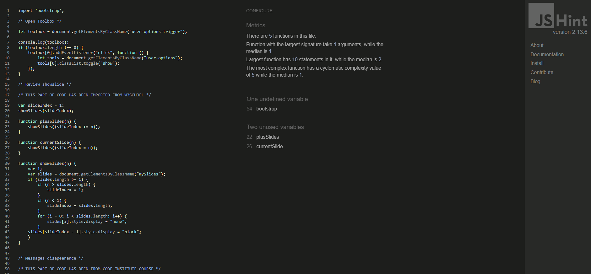

The result for the script.js file shows three errors:

- One undefined variable: emailjs

    there is no need to define emailjs in the sendEmail.js file as the init method is defined in the base.html file.

- One unused variable: sendEmail

    This function is defined in the sendEmail.js file but called in the base.html template.

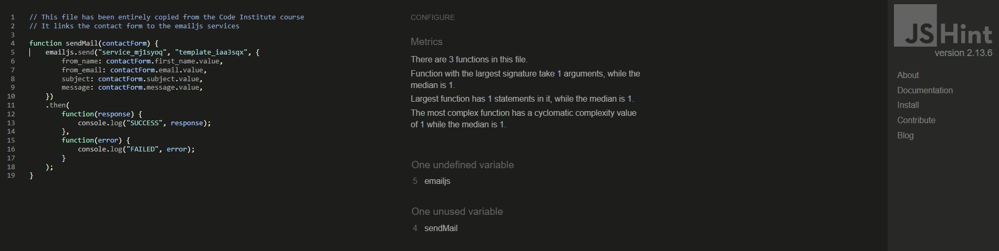

### 1.2.4. Python

Every Python file has been ran through the [CI Python Linter](https://pep8ci.herokuapp.com/) and for all of them the result was:
> All clear, no errors found

## 1.3. Lighthouse

The main pages of the website have been tested with the Lighthouse validator from Google Chrome.

The results are shown below.

### 1.3.1. The home page

    
Desktop

    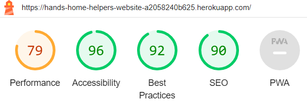

    
Mobile

    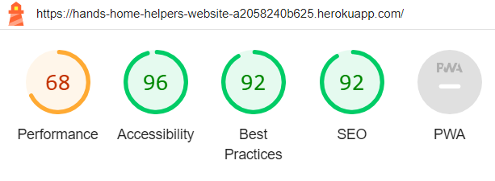

### 1.3.2. The dashboard

    
Desktop

    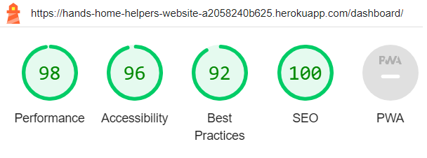

    
Mobile

    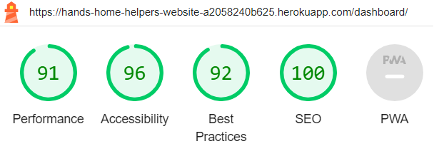

### 1.3.3. The offers page

    
Desktop

    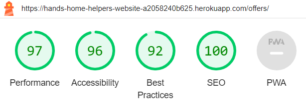

    
Mobile

    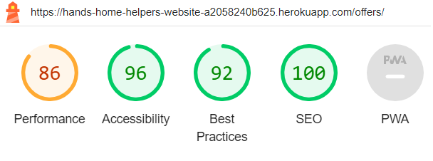

### 1.3.4. The about page

    
Desktop

    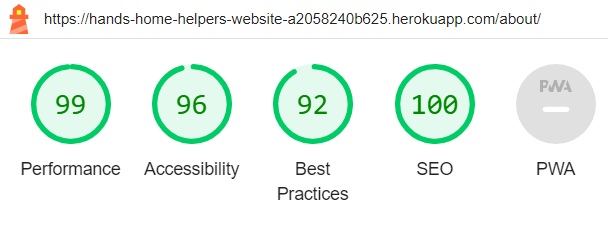

    
Mobile

    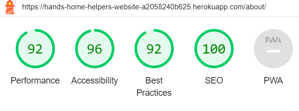

### 1.3.5. The contact page

    
Desktop

    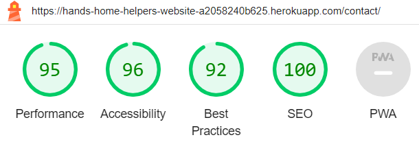

    
Mobile

    

### 1.3.6. The calendar page

    
Desktop

    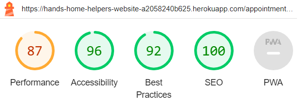

    
Mobile

    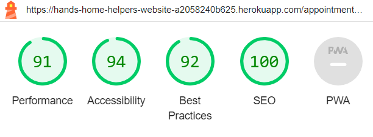

## 1.4. Manual Testing

### 1.4.1. User Stories Testing

User Story 9: As a Site User, I can register so that I can access restricted features.

- Browser compatibility and responsiveness testing:

|  | chrome-desktop | chrome-mobile | safari-desktop | safari-mobile | firefox-desktop | firefox-mobile |
| :--- | :---: | :---: | :---: | :---: | :---: | :---: |
| there is a link to the registration form |  |  |  |  |  |  |
| the registration form is properly displayed |  |  |  |  |  |  |
| Errors are displayed if the form is not valid |  |  |  |  |  |  |
| the database is updated when a valid form is submitted |  |  |  |  |  |  |
| users are redirected to their personal account when registered successfully |  |  |  |  |  |  |
| a unique username is required |  |  |  |  |  |  |
| a password is required |  |  |  |  |  |  |
| a password confirmation is required |  |  |  |  |  |  |
| an email address is optional |  |  |  |  |  |  |

---

User Story 10: As a Site User, I can log into my personal account so that I can access personal settings and data.

- Browser compatibility and responsiveness testing:

|  | chrome-desktop | chrome-mobile | safari-desktop | safari-mobile | firefox-desktop | firefox-mobile |
| :--- | :---: | :---: | :---: | :---: | :---: | :---: |
| there is a link to the login form |  |  |  |  |  |  |
| the login form is properly displayed |  |  |  |  |  |  |
| Errors are displayed if the form is not valid |  |  |  |  |  |  |
| users are redirected to their personal account when successfully logged in |  |  |  |  |  |  |
| a username is required |  |  |  |  |  |  |
| a password is required |  |  |  |  |  |  |

---

User Story 11: As a Logged in Site User, I can log out so that my personal data are safe.

- Browser compatibility and responsiveness testing:

|  | chrome-desktop | chrome-mobile | safari-desktop | safari-mobile | firefox-desktop | firefox-mobile |
| :--- | :---: | :---: | :---: | :---: | :---: | :---: |
| there is a button to logout |  |  |  |  |  |  |
| users are asked to confirm to logout |  |  |  |  |  |  |
| users are redirected to the home page when successfully logged out |  |  |  |  |  |  |
| users cannot access their personal account anymore |  |  |  |  |  |  |

---

User Story 12: As a Registered Site User, I can create a new task so that I can add it to my list of tasks.

- Browser compatibility and responsiveness testing:

|  | chrome-desktop | chrome-mobile | safari-desktop | safari-mobile | firefox-desktop | firefox-mobile |
| :--- | :---: | :---: | :---: | :---: | :---: | :---: |
| there is a button to create a task |  |  |  |  |  |  |
| the form to create a task is properly displayed |  |  |  |  |  |  |
| Errors are displayed if the form is not valid |  |  |  |  |  |  |
| There is a field for the name of the task |  |  |  |  |  |  |
| There is an option to repeat the task |  |  |  |  |  |  |
| There is a multiple choice field to select the category |  |  |  |  |  |  |
| There is a button to validate the form |  |  |  |  |  |  |
| users are redirected to their personal account when the task has been successfully created |  |  |  |  |  |  |
| the database is updated when a valid form is submitted |  |  |  |  |  |  |

---

User Story 13: As a Registered Site User, I can access my tasks so that I can list them.

- Browser compatibility and responsiveness testing:

|  | chrome-desktop | chrome-mobile | safari-desktop | safari-mobile | firefox-desktop | firefox-mobile |
| :--- | :---: | :---: | :---: | :---: | :---: | :---: |
| tasks are listed on the personal account |  |  |  |  |  |  |
| when clicking on a details button, I am redirected to a task detail page |  |  |  |  |  |  |
| tasks are properly displayed |  |  |  |  |  |  |

---

User Story 14: As a Registered Site User, I can modify my personal tasks so that I can update their information.

- Browser compatibility and responsiveness testing:

|  | chrome-desktop | chrome-mobile | safari-desktop | safari-mobile | firefox-desktop | firefox-mobile |
| :--- | :---: | :---: | :---: | :---: | :---: | :---: |
| there is a button to modify a task |  |  |  |  |  |  |
| the form to modify a task is properly displayed |  |  |  |  |  |  |
| Errors are displayed if the form is not valid |  |  |  |  |  |  |
| There is a field for the name of the task |  |  |  |  |  |  |
| There is an option to repeat the task |  |  |  |  |  |  |
| There is a multiple choice field to select the category |  |  |  |  |  |  |
| All field are prepopulated with the information from the selected task |  |  |  |  |  |  |
| There is a button to validate the form |  |  |  |  |  |  |
| There is a button to cancel the modification and go back to the personal account |  |  |  |  |  |  |
| users are redirected to their personal account when the task has been successfully created |  |  |  |  |  |  |
| the database is updated when a valid form is submitted |  |  |  |  |  |  |

---

User Story 15: As a Registered Site User, I can delete my personal tasks so that I can get rid of them.

- Browser compatibility and responsiveness testing:

|  | chrome-desktop | chrome-mobile | safari-desktop | safari-mobile | firefox-desktop | firefox-mobile |
| :--- | :---: | :---: | :---: | :---: | :---: | :---: |
| there is a button to delete a task |  |  |  |  |  |  |
| users are asked to confirm when clicking the delete button |  |  |  |  |  |  |
| There is a button to confirm the deletion |  |  |  |  |  |  |
| There is a button to cancel the deletion and go back to the personal account |  |  |  |  |  |  |
| users are redirected to their personal account when the task has been successfully deleted |  |  |  |  |  |  |
| the database is updated when a task has been successfully deleted |  |  |  |  |  |  |

---

EPIC 4: As a Site User, I can get notified of my actions so that I know if they were successful or not.

- Browser compatibility and responsiveness testing:

|  | chrome-desktop | chrome-mobile | safari-desktop | safari-mobile | firefox-desktop | firefox-mobile |
| :--- | :---: | :---: | :---: | :---: | :---: | :---: |
| User gets notified when signing up |  |  |  |  |  |  |
| User gets notified when signing in |  |  |  |  |  |  |
| User gets notified when login out |  |  |  |  |  |  |
| User gets notified when creating a task |  |  |  |  |  |  |
| User is asked to confirm before deleting a task |  |  |  |  |  |  |
| User gets notified when deleting a task |  |  |  |  |  |  |
| User gets notified when modifying a task |  |  |  |  |  |  |
| User gets notified when creating an appointment |  |  |  |  |  |  |
| User is asked to confirm before deleting an appointment |  |  |  |  |  |  |
| User gets notified when deleting an appointment |  |  |  |  |  |  |
| User gets notified when modifying an appointment |  |  |  |  |  |  |
| User gets notified when creating a review |  |  |  |  |  |  |
| User is asked to confirm before deleting a review |  |  |  |  |  |  |
| User gets notified when deleting a review |  |  |  |  |  |  |
| User gets notified when modifying a review |  |  |  |  |  |  |

---

User Story 33: As a Site User, I can land on a home page explaining the purpose of the website so that I know if it is answering my request.

- Browser compatibility and responsiveness testing:

|  | chrome-desktop | chrome-mobile | safari-desktop | safari-mobile | firefox-desktop | firefox-mobile |
| :--- | :---: | :---: | :---: | :---: | :---: | :---: |
| the landing page displays properly |  |  |  |  |  |  |
| every link is leading to the relevant page / section |  |  |  |  |  |  |
| there is a Call To Action |  |  |  |  |  |  |
| the page lists activities of the company |  |  |  |  |  |  |
| the page shows the logo and the name of the company |  |  |  |  |  |  |
| the page has a navigation menu |  |  |  |  |  |  |
| the page has a footer |  |  |  |  |  |  |
| the page shows a Hero-image |  |  |  |  |  |  |

---

User Story 41: As a Site User, I can open an about page so that I can find more information about the company.

- Browser compatibility and responsiveness testing:

|  | chrome-desktop | chrome-mobile | safari-desktop | safari-mobile | firefox-desktop | firefox-mobile |
| :--- | :---: | :---: | :---: | :---: | :---: | :---: |
| the about page displays properly |  |  |  |  |  |  |
| every link is leading to the relevant page / section |  |  |  |  |  |  |
| the page has an about us section |  |  |  |  |  |  |
| the page has a Meet the Team section |  |  |  |  |  |  |
| the page has a FAQ section |  |  |  |  |  |  |
| the page shows the logo and the name of the company |  |  |  |  |  |  |
| the page has a navigation menu |  |  |  |  |  |  |
| the page has a footer |  |  |  |  |  |  |

---

User Story 42: As a Site User, I am redirected to a custom 404-page when using the wrong URLs so that I know I am still on the website and I have a way to go back to a working page.

- Browser compatibility and responsiveness testing:

|  | chrome-desktop | chrome-mobile | safari-desktop | safari-mobile | firefox-desktop | firefox-mobile |
| :--- | :---: | :---: | :---: | :---: | :---: | :---: |
| the 404-error page displays properly |  |  |  |  |  |  |
| every link is leading to the relevant page / section |  |  |  |  |  |  |
| the page describes the error |  |  |  |  |  |  |
| the page has a way to go back to the main area of the website |  |  |  |  |  |  |
| the page shows the logo and the name of the company |  |  |  |  |  |  |
| the page has a navigation menu |  |  |  |  |  |  |
| the page has a footer |  |  |  |  |  |  |

---

User Story 43: As a Site User, I am redirected to a custom 500-page when the server cannot handle my request so that I know what is the issue.

- Browser compatibility and responsiveness testing:

|  | chrome-desktop | chrome-mobile | safari-desktop | safari-mobile | firefox-desktop | firefox-mobile |
| :--- | :---: | :---: | :---: | :---: | :---: | :---: |
| the 500-error page displays properly |  |  |  |  |  |  |
| every link is leading to the relevant page / section |  |  |  |  |  |  |
| the page describes the error |  |  |  |  |  |  |
| the page has a way to the contact form |  |  |  |  |  |  |
| the page shows the logo and the name of the company |  |  |  |  |  |  |
| the page has a navigation menu |  |  |  |  |  |  |
| the page has a footer |  |  |  |  |  |  |

---

User Story 56: As a Site Owner, I can redirect users to a custom 400-page when their request is suspicious so that the website is less exposed to security matters.

- Browser compatibility and responsiveness testing:

|  | chrome-desktop | chrome-mobile | safari-desktop | safari-mobile | firefox-desktop | firefox-mobile |
| :--- | :---: | :---: | :---: | :---: | :---: | :---: |
| the 400-error page displays properly |  |  |  |  |  |  |
| every link is leading to the relevant page / section |  |  |  |  |  |  |
| the page describes the error |  |  |  |  |  |  |
| the page has a way to go back to the main area of the website |  |  |  |  |  |  |
| the page shows the logo and the name of the company |  |  |  |  |  |  |
| the page has a navigation menu |  |  |  |  |  |  |
| the page has a footer |  |  |  |  |  |  |

---

User Story 44: As a Site User, I can use a contact form so that I can contact the company in a way that I am sure will get my request.

- Browser compatibility and responsiveness testing:

|  | chrome-desktop | chrome-mobile | safari-desktop | safari-mobile | firefox-desktop | firefox-mobile |
| :--- | :---: | :---: | :---: | :---: | :---: | :---: |
| the contact page displays properly |  |  |  |  |  |  |
| every link is leading to the relevant page / section |  |  |  |  |  |  |
| the page displays a form to submit a request |  |  |  |  |  |  |
| the form has a first_name field |  |  |  |  |  |  |
| the form has a last_name field |  |  |  |  |  |  |
| the form has a email_address field |  |  |  |  |  |  |
| the form has a subject field |  |  |  |  |  |  |
| the form has a message textarea field |  |  |  |  |  |  |
| the page shows the logo and the name of the company |  |  |  |  |  |  |
| the page has a navigation menu |  |  |  |  |  |  |
| the page has a footer |  |  |  |  |  |  |
| the page displays error when submitting a non valid form |  |  |  |  |  |  |
| the request is saved in the database when successfully submitted |  |  |  |  |  |  |
| an email is sent to the company when the form is successfully submitted |  |  |  |  |  |  |

---

EPIC 61: As a Site User, I can handle my appointments directly online so I am more flexible.

- Browser compatibility and responsiveness testing:

|  | chrome-desktop | chrome-mobile | safari-desktop | safari-mobile | firefox-desktop | firefox-mobile |
| :--- | :---: | :---: | :---: | :---: | :---: | :---: |
| Users can create an appointment |  |  |  |  |  |  |
| Users can delete their appointment |  |  |  |  |  |  |
| Users can modify their appointment |  |  |  |  |  |  |
| Users can read a detail of their appointment |  |  |  |  |  |  |
| Users get notified when creating, modifying or deleting an appointment |  |  |  |  |  |  |
| Users cannot overlap appointments |  |  |  |  |  |  |
| Users cannot book less than 1 hour appointment |  |  |  |  |  |  |

---

User Story 60: As a Site Administrator, I can manage offers of the company to customers so that I can adapt them to the market.

- Browser compatibility and responsiveness testing:

|  | chrome-desktop | chrome-mobile | safari-desktop | safari-mobile | firefox-desktop | firefox-mobile |
| :--- | :---: | :---: | :---: | :---: | :---: | :---: |
| Admins can create new offers via django admin panel |  |  |  |  |  |  |
| Admins can modify offers via django admin panel |  |  |  |  |  |  |
| Admins can delete offers via django admin panel |  |  |  |  |  |  |
| offers are properly displayed on the website |  |  |  |  |  |  |

### 1.4.2. Features Testing

A branding with a logo, a name, and the colors of the company.

- Browser compatibility and responsiveness testing:

|  | chrome-desktop | chrome-mobile | safari-desktop | safari-mobile | firefox-desktop | firefox-mobile |
| :--- | :---: | :---: | :---: | :---: | :---: | :---: |
| The logo is properly displayed |  |  |  |  |  |  |
| Clicking on the logo lead back to the landing page |  |  |  |  |  |  |
| The branding appears on every page |  |  |  |  |  |  |

---

A navigation menu.

- Browser compatibility and responsiveness testing:

|  | chrome-desktop | chrome-mobile | safari-desktop | safari-mobile | firefox-desktop | firefox-mobile |
| :--- | :---: | :---: | :---: | :---: | :---: | :---: |
| The navigation menu is properly displayed |  |  |  |  |  |  |
| Each link leads to the relevant page / section |  |  |  |  |  |  |
| Links to restricted pages only appear for authorized users |  |  |  |  |  |  |

---

Greetings.

- Browser compatibility and responsiveness testing:

|  | chrome-desktop | chrome-mobile | safari-desktop | safari-mobile | firefox-desktop | firefox-mobile |
| :--- | :---: | :---: | :---: | :---: | :---: | :---: |
| Personal greetings are displayed when logged in |  |  |  |  |  |  |

---

A call to action (CTA) on a Hero-image.

- Browser compatibility and responsiveness testing:

|  | chrome-desktop | chrome-mobile | safari-desktop | safari-mobile | firefox-desktop | firefox-mobile |
| :--- | :---: | :---: | :---: | :---: | :---: | :---: |
| The Hero-image is properly displayed |  |  |  |  |  |  |
| The call to action is obvious |  |  |  |  |  |  |
| The call to action leads to the registration page |  |  |  |  |  |  |

---

Caroussels to present the company's activities.

- Browser compatibility and responsiveness testing:

|  | chrome-desktop | chrome-mobile | safari-desktop | safari-mobile | firefox-desktop | firefox-mobile |
| :--- | :---: | :---: | :---: | :---: | :---: | :---: |
| Carroussels are properly displayed |  |  |  |  |  |  |
| Caroussels show the relevant images |  |  |  |  |  |  |

---

A footer with links to social media and extra resources.

- Browser compatibility and responsiveness testing:

|  | chrome-desktop | chrome-mobile | safari-desktop | safari-mobile | firefox-desktop | firefox-mobile |
| :--- | :---: | :---: | :---: | :---: | :---: | :---: |
| The footer is properly displayed |  |  |  |  |  |  |
| The social media links open in a new tab and lead to the relevant platform |  |  |  |  |  |  |
| The extra resources lead to the relevant page / section |  |  |  |  |  |  |

---

A copyright.

- Browser compatibility and responsiveness testing:

|  | chrome-desktop | chrome-mobile | safari-desktop | safari-mobile | firefox-desktop | firefox-mobile |
| :--- | :---: | :---: | :---: | :---: | :---: | :---: |
| The copyright is properly displayed |  |  |  |  |  |  |
| The copyright shows the current year |  |  |  |  |  |  |
| The link to GitHub open in a new tab and lead to the relevant page |  |  |  |  |  |  |

---

A personal dashboard.

- Browser compatibility and responsiveness testing:

|  | chrome-desktop | chrome-mobile | safari-desktop | safari-mobile | firefox-desktop | firefox-mobile |
| :--- | :---: | :---: | :---: | :---: | :---: | :---: |
| The content is properly displayed |  |  |  |  |  |  |
| Each link leads to the relevant content |  |  |  |  |  |  |
| Each button acts as expected |  |  |  |  |  |  |
| Only content related to the user is displayed |  |  |  |  |  |  |

## 1.5. Automated testing

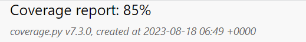

Some automated tests have been implemented using unittest.

The coverage library has been used to get a visual report of automated testing.

### 1.5.1. Appointments app

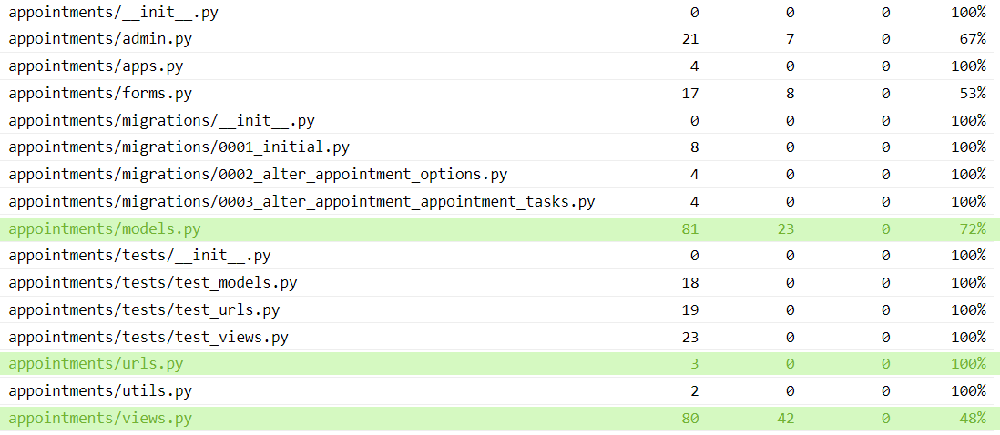

### 1.5.2. Config app

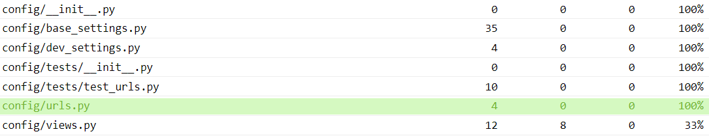

### 1.5.3. Contact app

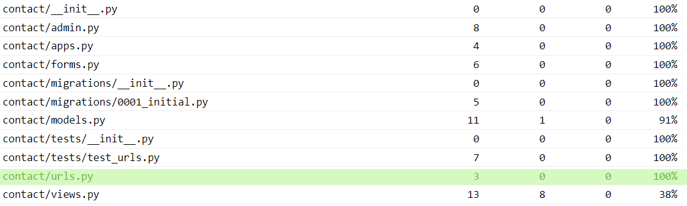

### 1.5.4. Offers app

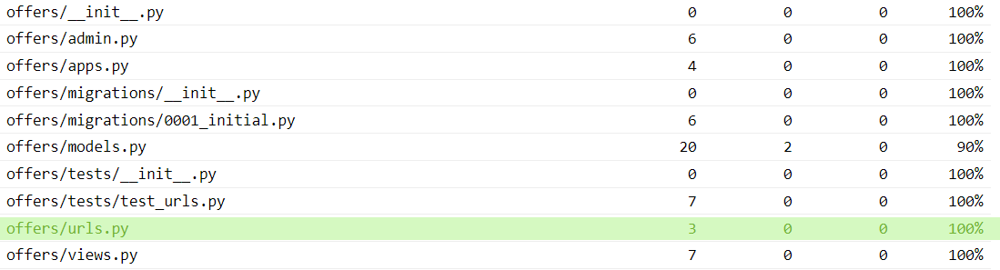

### 1.5.5. Reviews app

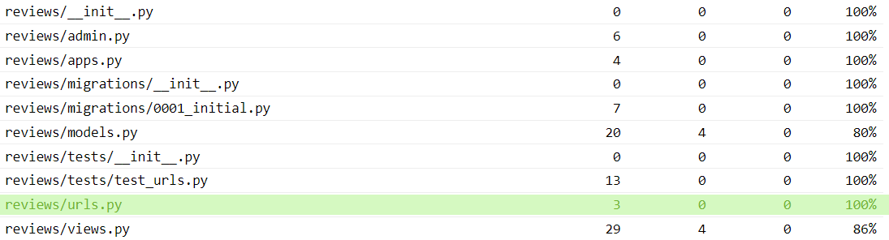

### 1.5.6. Tasks app

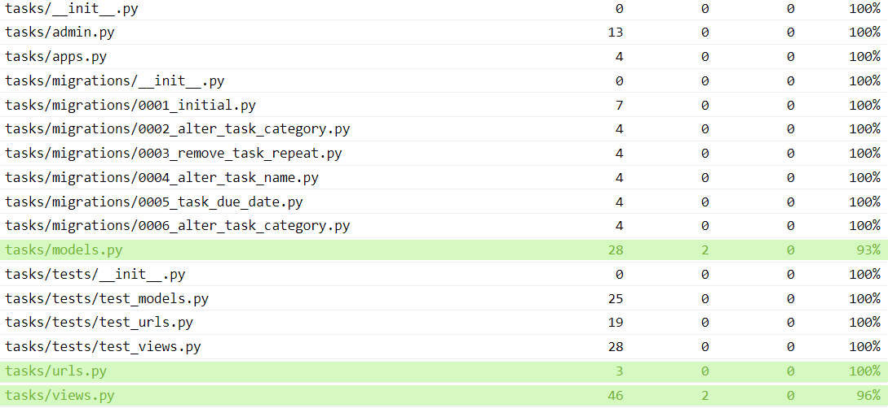

## 1.6. Bugs

- Deployment not working - 

  The deployment did not work at first. I have created 3 setting files. One for development, one for production, and one common to both. Therefore, I needed to modify the manage.py and the wsgi.py files. However, I only had modified the manage.py file so the deployment work fine but the application was not working. I fixed this issue by modifying the wsgi.py file.

- Hero image was not displayed - 
  
  On the deployed version, the Hero image on the landing page would not show up. It was a background image of a div element. So the file path to the image was used within the CSS file. I had the background-image property to the style attribute of the div within the HTML file using the static tag. This fixed the problem.

- Emailjs does not work - 

  On the deployed version, the EmailJS API would not send emails. I realized that I called my file and my function with the same name. I changed it to give them different names and the problem was solved.

- EmailJS only works when using the Chrome browser - 

  For some reasons that could not be identified, EmailJS does not send emails when using Firefox or Safari browsers. As the issue has not been identified, the bug could not be resolved.

- Reviews stay online after modification - 

    By default, reviews are not directly online. They must be approved by an administrator to be published on the website. However, when a review is approved and then modified by the author of the given review, it stays online without the enhancements having been approved. This bug was not resolved because it was not a priority and time was missing.

- Tasks booked and unbooked keep their due date - 

    When a task is created, its due date value is None. Then when a task is assigned to an appointment, the date of the appointment becomes the due date of the task. However, if the task would be unassigned or the appointment is deleted, the task keeps its due date. This is not only problematic because it has a wrong due date, but also because the task would not be displayed in the options when creating a new appointment. So the task can never be assigned again. An easy and quick fix could be to change the on_delete argument in the model to delete the task when the appointment would be deleted. But it would only solve half of the problem. In fact, if the task would be unassigned, it would still keep its due date. Time is missing and this issue might remain unresolved.

- No way to access the full content of a review when longer than 50 characters - 

  The first idea was to display only the beginning of reviews if they would be too long. But somehow, in the implementation, I lost focus and thought that there was no need for a review detailed view. The direct consequence is that there was no way to read the full reviews for the ones being truncated. A quick fix was to take off the truncate filter from the template.

- User should not be able to book an appointment on Sundays - 

  The monthly calendar has been implemented with links for every single day to lead to a daily view of the selected day. With if statements, past days and Sundays would not offer that link anymore so users could not select those days to book an appointment.
  Nevertheless, from the daily calendar of a valid day, users could navigate with the next or previous button until a Sunday and create an appointment from there. This problem has been solved with an if statement within the Django template to add two days to the selected day instead of one if the selected day is a Saturday when clicking the next button and the same logic inverse to Mondays when clicking the previous button.

- User should not be able to book an appointment on past days - 

    While I was writing the previous bug, I realized that there was a similar issue in the past days. This issue has been fixed by adding a variable called upcoming day to the booking view in the appointments app and an if statement in the template to only display the link to the previous day if that day is still in the future.

- Success notifications not displayed on deletion - 

  With the Django mixins, it was quite simple to display a notification to users when they create, update, login, log out, or register. But it was not the case for the class-based delete view. I had to override the delete method of that view so that the notification would be displayed.

Return to the [README.md](README.md) file
