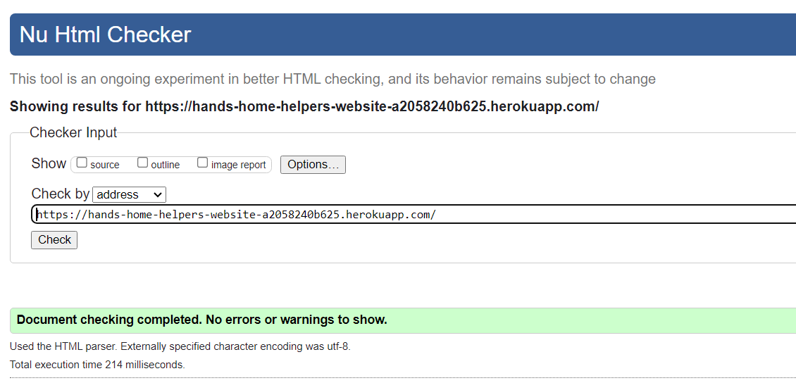
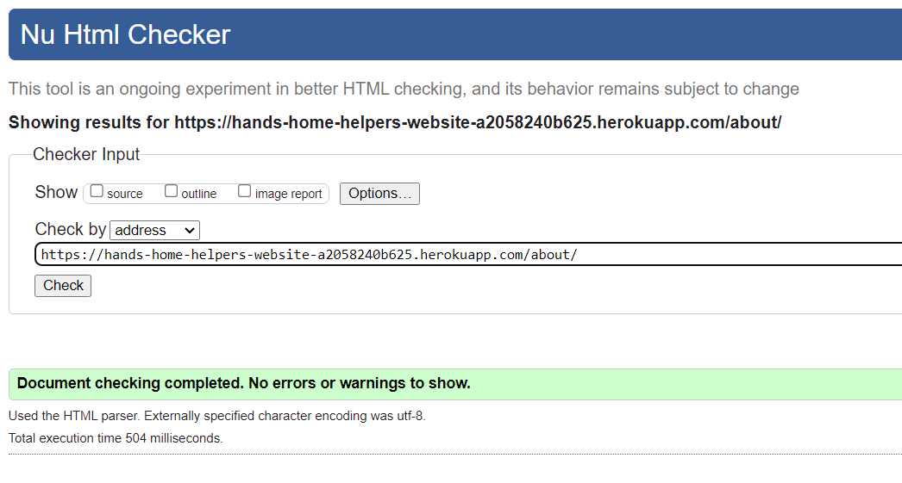
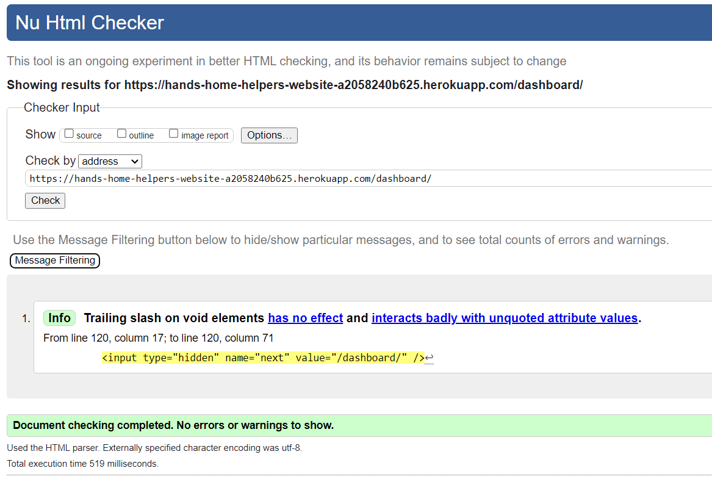
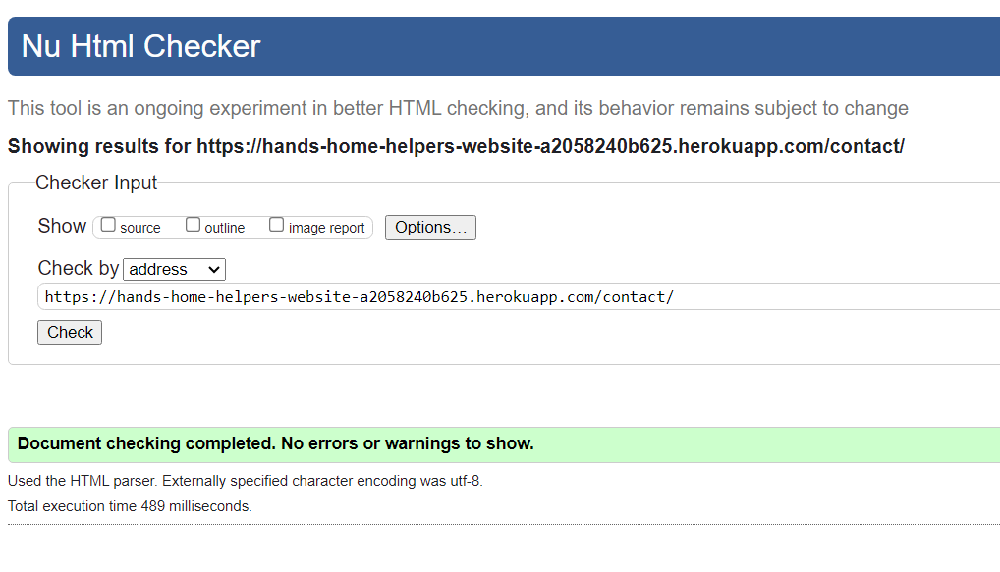
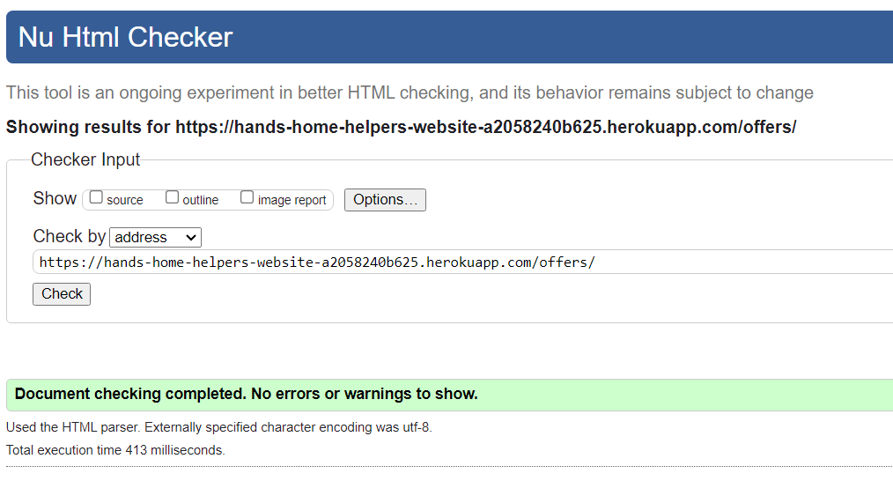
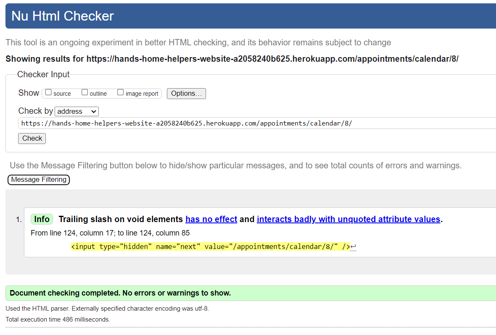
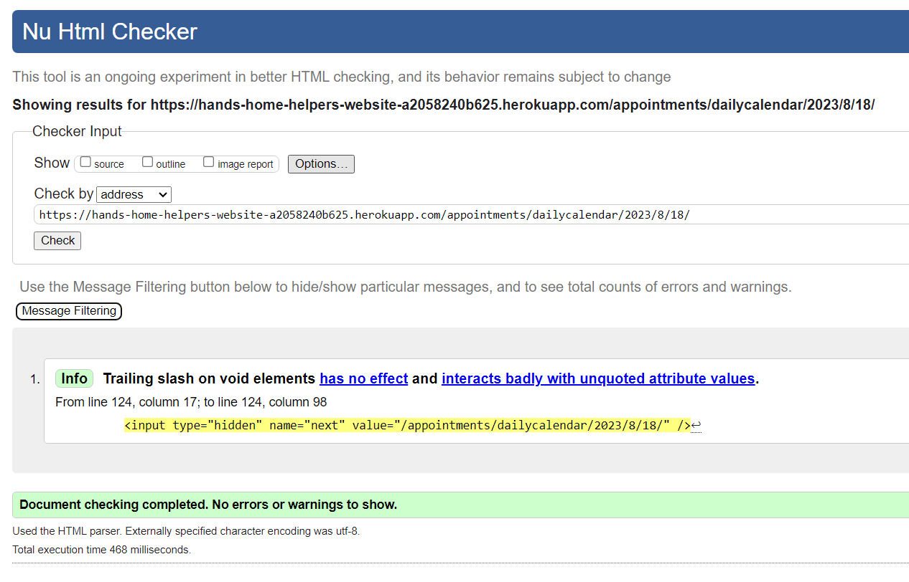
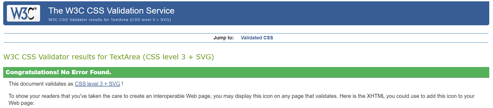

# Hands Home Helpers

***- TESTING DOCUMENTATION -***

## Code Validation

### HTML

- w3c markup validator results for the landing page:

- w3c markup validator results for the about page:

- w3c markup validator results for the personal dashboard:

- w3c markup validator results for the contact page:

- w3c markup validator results for the offers:

- w3c markup validator results for the calendar:

- w3c markup validator results for the dailycalendar:

### CSS 

### JavaScript
  
### Python

Every python file has been ran through the [CI Python Linter](https://pep8ci.herokuapp.com/) and for all of them the result was:
> All clear, no errors found

## Lighthouse

## Manual Testing

### User Stories Testing

User Story 9 : As a Site User, I can register so that I can access restricted features.

- Browser compatibility and responsiveness testing:

|  | chrome-desktop | chrome-mobile | safari-desktop | safari-mobile | firefox-desktop | firefox-mobile |
| :--- | --- | --- | --- | --- | --- | --- |
| there is a link to the registration form |  |  |  |  |  |  |
| the registration form is properly displayed |  |  |  |  |  |  |
| Errors are displayed if the form is not valid |  |  |  |  |  |  |
| the database is updated when a valid form is submitted |  |  |  |  |  |  |
| users are redirected to their personal account when registered successfully |  |  |  |  |  |  |
| a unique username is required |  |  |  |  |  |  |
| a password is required |  |  |  |  |  |  |
| a password confirmation is required |  |  |  |  |  |  |
| an email address is optional |  |  |  |  |  |  |

---

User Story 10 : As a Site User, I can log into my personal account so that I can access personal settings and data.

- Browser compatibility and responsiveness testing:

|  | chrome-desktop | chrome-mobile | safari-desktop | safari-mobile | firefox-desktop | firefox-mobile |
| :--- | --- | --- | --- | --- | --- | --- |
| there is a link to the login form |  |  |  |  |  |  |
| the login form is properly displayed |  |  |  |  |  |  |
| Errors are displayed if the form is not valid |  |  |  |  |  |  |
| users are redirected to their personal account when successfully logged in |  |  |  |  |  |  |
| a username is required |  |  |  |  |  |  |
| a password is required |  |  |  |  |  |  |

---

User Story 11 : As a Logged in Site User, I can log out so that my personal data are safe.

- Browser compatibility and responsiveness testing:

|  | chrome-desktop | chrome-mobile | safari-desktop | safari-mobile | firefox-desktop | firefox-mobile |
| :--- | --- | --- | --- | --- | --- | --- |
| there is a button to logout |  |  |  |  |  |  |
| users are asked to confirm to logout |  |  |  |  |  |  |
| users are redirected to the home page when successfully logged out |  |  |  |  |  |  |
| users cannot access their personal account anymore |  |  |  |  |  |  |

---

User Story 12 : As a Registered Site User, I can create a new task so that I can add it to my list of tasks.

- Browser compatibility and responsiveness testing:

|  | chrome-desktop | chrome-mobile | safari-desktop | safari-mobile | firefox-desktop | firefox-mobile |
| :--- | --- | --- | --- | --- | --- | --- |
| there is a button to create a task |  |  |  |  |  |  |
| the form to create a task is properly displayed |  |  |  |  |  |  |
| Errors are displayed if the form is not valid |  |  |  |  |  |  |
| There is a field for the name of the task |  |  |  |  |  |  |
| There is an option to repeat the task |  |  |  |  |  |  |
| There is a multiple choice field to select the category |  |  |  |  |  |  |
| There is a button to validate the form |  |  |  |  |  |  |
| users are redirected to their personal account when the task has been successfully created |  |  |  |  |  |  |
| the database is updated when a valid form is submitted |  |  |  |  |  |  |

---

User Story 13 : As a Registered Site User, I can access my tasks so that I can list them.

- Browser compatibility and responsiveness testing:

|  | chrome-desktop | chrome-mobile | safari-desktop | safari-mobile | firefox-desktop | firefox-mobile |
| :--- | --- | --- | --- | --- | --- | --- |
| tasks are listed on the personal account |  |  |  |  |  |  |
| when clicking on a task, I am redirected to a task detail page |  |  |  |  |  |  |
| tasks are properly displayed |  |  |  |  |  |  |

---

User Story 14 : As a Registered Site User, I can modify my personal tasks so that I can update their information.

- Browser compatibility and responsiveness testing:

|  | chrome-desktop | chrome-mobile | safari-desktop | safari-mobile | firefox-desktop | firefox-mobile |
| :--- | --- | --- | --- | --- | --- | --- |
| there is a button to modify a task |  |  |  |  |  |  |
| the form to modify a task is properly displayed |  |  |  |  |  |  |
| Errors are displayed if the form is not valid |  |  |  |  |  |  |
| There is a field for the name of the task |  |  |  |  |  |  |
| There is an option to repeat the task |  |  |  |  |  |  |
| There is a multiple choice field to select the category |  |  |  |  |  |  |
| All field are prepopulated with the information from the selected task |  |  |  |  |  |  |
| There is a button to validate the form |  |  |  |  |  |  |
| There is a button to cancel the modification and go back to the personal account |  |  |  |  |  |  |
| users are redirected to their personal account when the task has been successfully created |  |  |  |  |  |  |
| the database is updated when a valid form is submitted |  |  |  |  |  |  |

---

User Story 15 : As a Registered Site User, I can delete my personal tasks so that I can get rid of them.

- Browser compatibility and responsiveness testing:

|  | chrome-desktop | chrome-mobile | safari-desktop | safari-mobile | firefox-desktop | firefox-mobile |
| :--- | --- | --- | --- | --- | --- | --- |
| there is a button to delete a task |  |  |  |  |  |  |
| users are asked to confirm when clicking the delete button |  |  |  |  |  |  |
| There is a button to confirm the deletion |  |  |  |  |  |  |
| There is a button to cancel the deletion and go back to the personal account |  |  |  |  |  |  |
| users are redirected to their personal account when the task has been successfully deleted |  |  |  |  |  |  |
| the database is updated when a task has been successfully deleted |  |  |  |  |  |  |

---

EPIC 4 : As a Site User, I can get notified of my actions so that I know if theY were successful or not.

- Browser compatibility and responsiveness testing:

|  | chrome-desktop | chrome-mobile | safari-desktop | safari-mobile | firefox-desktop | firefox-mobile |
| :--- | --- | --- | --- | --- | --- | --- |
| User gets notified when signing up |  |  |  |  |  |  |
| User gets notified when signing in |  |  |  |  |  |  |
| User gets notified when login out |  |  |  |  |  |  |
| User gets notified when creating a task |  |  |  |  |  |  |
| User is asked to confirm before deleting a task |  |  |  |  |  |  |
| User gets notified when deleting a task |  |  |  |  |  |  |
| User gets notified when modifying a task |  |  |  |  |  |  |

---

User Story 33 : As a Site User, I can land on a home page explaining the purpose of the website so that I know if it is answering my request.

- Browser compatibility and responsiveness testing:

|  | chrome-desktop | chrome-mobile | safari-desktop | safari-mobile | firefox-desktop | firefox-mobile |
| :--- | --- | --- | --- | --- | --- | --- |
| the landing page displays properly |  |  |  |  |  |  |
| every link is leading to the relevant page / section |  |  |  |  |  |  |
| there is a Call To Action |  |  |  |  |  |  |
| the page lists activities of the company |  |  |  |  |  |  |
| the page shows the logo and the name of the company |  |  |  |  |  |  |
| the page has a navigation menu |  |  |  |  |  |  |
| the page has a footer |  |  |  |  |  |  |
| the page shows a Hero-image |  |  |  |  |  |  |

---

User Story 41 : As a Site User, I can open an about page so that I can find more information about the company.

- Browser compatibility and responsiveness testing:

|  | chrome-desktop | chrome-mobile | safari-desktop | safari-mobile | firefox-desktop | firefox-mobile |
| :--- | --- | --- | --- | --- | --- | --- |
| the about page displays properly |  |  |  |  |  |  |
| every link is leading to the relevant page / section |  |  |  |  |  |  |
| the page has an about us section |  |  |  |  |  |  |
| the page has a Meet the Team section |  |  |  |  |  |  |
| the page has a FAQ section |  |  |  |  |  |  |
| the page shows the logo and the name of the company |  |  |  |  |  |  |
| the page has a navigation menu |  |  |  |  |  |  |
| the page has a footer |  |  |  |  |  |  |

---

User Story 42 : As a Site User, I am redirected to a custom 404-page when using the wrong URLs so that I know I am still on the website and I have a way to go back to a working page.

- Browser compatibility and responsiveness testing:

|  | chrome-desktop | chrome-mobile | safari-desktop | safari-mobile | firefox-desktop | firefox-mobile |
| :--- | --- | --- | --- | --- | --- | --- |
| the 404-error page displays properly |  |  |  |  |  |  |
| every link is leading to the relevant page / section |  |  |  |  |  |  |
| the page describes the error |  |  |  |  |  |  |
| the page has a way to go back to the main area of the website |  |  |  |  |  |  |
| the page shows the logo and the name of the company |  |  |  |  |  |  |
| the page has a navigation menu |  |  |  |  |  |  |
| the page has a footer |  |  |  |  |  |  |

---

User Story 43 : As a Site User, I am redirected to a custom 500-page when the server cannot handle my request so that I know what is the issue.

- Browser compatibility and responsiveness testing:

|  | chrome-desktop | chrome-mobile | safari-desktop | safari-mobile | firefox-desktop | firefox-mobile |
| :--- | --- | --- | --- | --- | --- | --- |
| the 500-error page displays properly |  |  |  |  |  |  |
| every link is leading to the relevant page / section |  |  |  |  |  |  |
| the page describes the error |  |  |  |  |  |  |
| the page has a way to the contact form |  |  |  |  |  |  |
| the page shows the logo and the name of the company |  |  |  |  |  |  |
| the page has a navigation menu |  |  |  |  |  |  |
| the page has a footer |  |  |  |  |  |  |

---

User Story 56 : As a Site Owner, I can redirect users to a custom 400-page when their request is suspicious so that the website is less exposed to security matter.

- Browser compatibility and responsiveness testing:

|  | chrome-desktop | chrome-mobile | safari-desktop | safari-mobile | firefox-desktop | firefox-mobile |
| :--- | --- | --- | --- | --- | --- | --- |
| the 400-error page displays properly |  |  |  |  |  |  |
| every link is leading to the relevant page / section |  |  |  |  |  |  |
| the page describes the error |  |  |  |  |  |  |
| the page has a way to go back to the main area of the website |  |  |  |  |  |  |
| the page shows the logo and the name of the company |  |  |  |  |  |  |
| the page has a navigation menu |  |  |  |  |  |  |
| the page has a footer |  |  |  |  |  |  |

---

User Story 44 : As a Site User, I can use a contact form so that I can contact the company in a way that I am sure they will get my request.

- Browser compatibility and responsiveness testing:

|  | chrome-desktop | chrome-mobile | safari-desktop | safari-mobile | firefox-desktop | firefox-mobile |
| :--- | --- | --- | --- | --- | --- | --- |
| the contact page displays properly |  |  |  |  |  |  |
| every link is leading to the relevant page / section |  |  |  |  |  |  |
| the page displays a form to submit a request |  |  |  |  |  |  |
| the form has a first_name field |  |  |  |  |  |  |
| the form has a last_name field |  |  |  |  |  |  |
| the form has a email_address field |  |  |  |  |  |  |
| the form has a subject field |  |  |  |  |  |  |
| the form has a message textarea field |  |  |  |  |  |  |
| the page shows the logo and the name of the company |  |  |  |  |  |  |
| the page has a navigation menu |  |  |  |  |  |  |
| the page has a footer |  |  |  |  |  |  |
| the page displays error when submitting a non valid form |  |  |  |  |  |  |
| the request is saved in the database when successfully submitted |  |  |  |  |  |  |
| an email is sent to the company when the form is successfully submitted |  |  |  |  |  |  |

---

EPIC 61 : As a Site User, I can handle my appointments directly online so that I am more flexible.

- Browser compatibility and responsiveness testing:

|  | chrome-desktop | chrome-mobile | safari-desktop | safari-mobile | firefox-desktop | firefox-mobile |
| :--- | --- | --- | --- | --- | --- | --- |
| Users can create an appointment |  |  |  |  |  |  |
| Users can delete their appointment |  |  |  |  |  |  |
| Users can modify their appointment |  |  |  |  |  |  |
| Users can read a detail of their appointment |  |  |  |  |  |  |
| Users get notified when creating, modifying or deleting an appointment |  |  |  |  |  |  |
| Users cannot overlap appointments |  |  |  |  |  |  |
| Users cannot book less than 1 hour appointment |  |  |  |  |  |  |

---

User Story 60 : As a Site Administrator, I can manage offers of the company to customers so that I can adapt them to the market.

- Browser compatibility and responsiveness testing:

|  | chrome-desktop | chrome-mobile | safari-desktop | safari-mobile | firefox-desktop | firefox-mobile |
| :--- | --- | --- | --- | --- | --- | --- |
| Admins can create new offers via django admin panel |  |  |  |  |  |  |
| Admins can modify offers via django admin panel |  |  |  |  |  |  |
| Admins can delete offers via django admin panel |  |  |  |  |  |  |
| offers are properly displayed on the website |  |  |  |  |  |  |

### Features Testing

A branding with a logo, a name, and the colors of the company.

- Browser compatibility and responsiveness testing:

|  | chrome-desktop | chrome-mobile | safari-desktop | safari-mobile | firefox-desktop | firefox-mobile |
| :--- | --- | --- | --- | --- | --- | --- |
| The logo is properly displayed |  |  |  |  |  |  |
| Clicking on the logo lead back to the landing page |  |  |  |  |  |  |
| The branding appears on every page |  |  |  |  |  |  |

---

A navigation menu.

- Browser compatibility and responsiveness testing:

|  | chrome-desktop | chrome-mobile | safari-desktop | safari-mobile | firefox-desktop | firefox-mobile |
| :--- | --- | --- | --- | --- | --- | --- |
| The navigation menu is properly displayed |  |  |  |  |  |  |
| Each link leads to the relevant page / section |  |  |  |  |  |  |
| Links to restricted pages only appear for authorized users |  |  |  |  |  |  |

---

Greetings.

- Browser compatibility and responsiveness testing:

|  | chrome-desktop | chrome-mobile | safari-desktop | safari-mobile | firefox-desktop | firefox-mobile |
| :--- | --- | --- | --- | --- | --- | --- |
| Greetings are displayed when logged in |  |  |  |  |  |  |

---

A call to action (CTA) on a Hero-image.

- Browser compatibility and responsiveness testing:

|  | chrome-desktop | chrome-mobile | safari-desktop | safari-mobile | firefox-desktop | firefox-mobile |
| :--- | --- | --- | --- | --- | --- | --- |
| The Hero-image is properly displayed |  |  |  |  |  |  |
| The call to action is obvious |  |  |  |  |  |  |
| The call to action leads to the registration page |  |  |  |  |  |  |

---

Caroussels to present the company's activities.

- Browser compatibility and responsiveness testing:

|  | chrome-desktop | chrome-mobile | safari-desktop | safari-mobile | firefox-desktop | firefox-mobile |
| :--- | --- | --- | --- | --- | --- | --- |
| Carroussels are properly displayed |  |  |  |  |  |  |
| Caroussels show the relevant images |  |  |  |  |  |  |

---

A footer with links to social medias and extra resources.

- Browser compatibility and responsiveness testing:

|  | chrome-desktop | chrome-mobile | safari-desktop | safari-mobile | firefox-desktop | firefox-mobile |
| :--- | --- | --- | --- | --- | --- | --- |
| The footer is properly displayed |  |  |  |  |  |  |
| The social media links open in a new tab and lead to the relevant platform |  |  |  |  |  |  |
| The extra resources lead to the relevant page / section |  |  |  |  |  |  |

---

A copyright.

- Browser compatibility and responsiveness testing:

|  | chrome-desktop | chrome-mobile | safari-desktop | safari-mobile | firefox-desktop | firefox-mobile |
| :--- | --- | --- | --- | --- | --- | --- |
| The copyright is properly displayed |  |  |  |  |  |  |
| The copyright shows the current year |  |  |  |  |  |  |
| The to GitHub open in a new tab and lead to the relevant page |  |  |  |  |  |  |

---

A personal dashboard.

- Browser compatibility and responsiveness testing:

|  | chrome-desktop | chrome-mobile | safari-desktop | safari-mobile | firefox-desktop | firefox-mobile |
| :--- | --- | --- | --- | --- | --- | --- |
| The content is properly displayed |  |  |  |  |  |  |
| Each link leads to the relevant content |  |  |  |  |  |  |
| Each button acts as expected |  |  |  |  |  |  |
| Each button acts as expected |  |  |  |  |  |  |
| Only content related to the user is displayed |  |  |  |  |  |  |

## Bugs

- Deployment not working - 

  Deployment did not work at first. I have created 3 setting files. One for development, one for production and one common to both. Therefore, I needed to modify the manage.py and the wsgi.py files. However, I only had modified the manage.py file so the deployment work fine but the application was not working. I fixed this issue by modifying the wsgi.py file.

- Hero image was not displayed - 
  
  On the deployed version, the Hero image on the landing page would not show up. It was a background-image of a div element. So the file path to the image was used within the css file. I had the background-image property to the style attribute of the div within the html file using the static tag. This fixed the problem.

- Emailjs does not work - 

  On the deployed version, the EmailJS API would not send email. I realised that I called my file and my function with the same name. I changed it to give them different names and the problem was solved.
